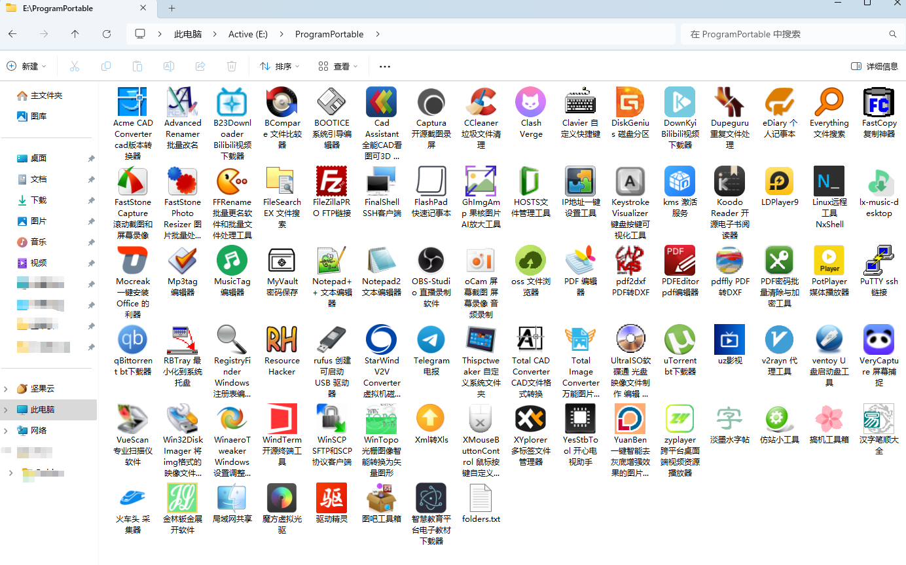

# IconFolio - Windows文件夹图标批量管理工具

## 📖 项目简介

IconFolio是一款功能强大的Windows文件夹图标批量管理工具，可以帮助您快速、高效地自定义大量文件夹的图标和显示名称。无论是整理个人文件、优化工作环境还是美化项目结构，IconFolio都能为您提供便捷的解决方案。



## ✨ 核心功能

- **批量图标设置**：一次性为多个文件夹设置自定义图标
- **文件夹别名**：为文件夹设置个性化的显示名称
- **配置文件管理**：生成、更新和清理文件夹图标配置文件
- **图标缓存刷新**：自动刷新Windows图标缓存，立即生效
- **双模式操作**：支持交互式和自动两种操作模式
- **便携设计**：可打包为单个可执行文件，无需安装Python环境

## 🛠️ 工作原理

IconFolio基于Windows系统的特性，通过以下机制实现文件夹图标和名称的自定义：

1. **desktop.ini文件生成**：
   - 为每个目标文件夹创建或修改desktop.ini文件
   - 在文件中设置`.ShellClassInfo`节，包含图标路径和显示名称
   - 将desktop.ini文件设置为系统隐藏属性
   - 将文件夹设置为只读属性，触发Windows使用自定义图标

2. **配置文件管理**：
   - 使用`folders.txt`文件存储文件夹路径、显示名称和图标路径的映射关系
   - 支持交互式生成和更新配置文件
   - 支持自动扫描生成配置文件

3. **图标缓存刷新**：
   - 调用Windows API函数刷新系统图标缓存
   - 支持多种缓存刷新策略（移动desktop.ini文件、修改注册表等）
   - 使用`ctypes`和`win32api`库实现底层系统调用

## 🚀 使用方法

### 1. 下载与运行

- **方法一**：直接运行打包好的`IconFolio.exe`文件（无需安装Python）
- **方法二**：在Python环境中运行`IconFolio.py`（需要安装依赖库）

### 2. 交互式菜单

程序提供了9个功能选项的交互式菜单：

```
[1] 清理所有desktop.ini文件
[2] 生成folders.txt配置文件(交互式)
[3] 生成folders.txt配置文件(自动)
[4] 更新folders.txt配置文件(仅添加新文件夹)
[5] 根据folders.txt生成desktop.ini文件
[6] 手动刷新所有文件夹图标缓存
[7] 清理单个文件夹的desktop.ini文件
[8] 生成单个文件夹的desktop.ini文件
[9] 手动刷新单个文件夹图标缓存
```

### 3. 推荐操作流程

1. 首先使用**选项1**清理所有现有的desktop.ini文件（可选）
2. 使用**选项9**刷新系统缓存（确保清理生效）
3. 使用**选项2**或**选项3**生成folders.txt配置文件
4. 编辑folders.txt文件，自定义文件夹图标和显示名称
5. 使用**选项5**根据配置文件生成desktop.ini文件
6. 使用**选项6**刷新所有文件夹的图标缓存
7. 如有需要，使用**选项7-9**对单个文件夹进行操作

### 4. 配置文件格式

`folders.txt`配置文件采用简单的文本格式，每行代表一个文件夹的配置：

```
文件夹路径|显示名称|图标文件路径
```

- 文件夹路径：目标文件夹的绝对路径
- 显示名称：文件夹的自定义显示名称（留空则使用原名称）
- 图标文件路径：图标文件(.ico)的绝对路径

## 💻 技术实现

- **编程语言**：Python 3.x
- **核心依赖库**：
  - `os`：文件和目录操作
  - `sys`：系统参数和退出控制
  - `ctypes`：调用Windows API
  - `win32api`、`win32con`：Windows系统操作
  - `shutil`：高级文件操作
- **编码处理**：适配Windows系统的文件编码
- **缓存刷新策略**：多种方法确保图标变更立即生效

## 📋 注意事项

1. **系统要求**：仅支持Windows操作系统
2. **权限要求**：需要管理员权限才能刷新系统图标缓存
3. **图标格式**：推荐使用.ico格式的图标文件
4. **图标路径**：配置文件中的图标路径建议使用绝对路径
5. **兼容性**：在不同版本的Windows系统上可能需要调整缓存刷新策略

## 🛠️ 开发与扩展

如果您想扩展或修改IconFolio的功能：

1. 克隆仓库：`git clone https://github.com/imlgmcom/IconFolio.git`
2. 安装依赖：`pip install pywin32`
3. 修改`IconFolio.py`文件中的相应功能
4. 打包为可执行文件：`pyinstaller --onefile IconFolio.py`

## 🤝 贡献指南

欢迎您对IconFolio项目进行贡献：

1. Fork项目仓库
2. 创建功能分支
3. 提交您的修改
4. 创建Pull Request

## 📄 许可证

本项目采用MIT许可证 - 详见LICENSE文件

## 🙏 致谢

感谢所有为这个项目提供帮助和支持的开发者！

---

**版本**：v25.9.6
**更新日期**：2025-09-08
**作者**：IconFolio团队